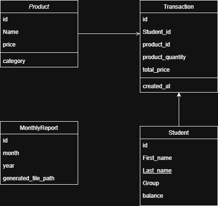

# 🍽 QR Lunch Ordering System
### Business Analysis Case Study

**Languages:** [English](README.md) | [Українська](README_UA.md)

A Business Analysis pet-project that automates student meal payments using QR-code identification.

The system allows fast student identification, automatic balance deduction, transaction tracking, and monthly reporting for accounting.

---

## 📌 Problem

The current cafeteria process is manual:
- paper-based lists
- slow identification
- queues
- calculation errors
- difficult reporting

---

## 🎯 Goal

Automate the process using:
- QR identification
- digital transactions
- centralized database
- automatic monthly reports

---

## ⚙️ Features

✅ QR identification  
✅ Balance check  
✅ Meal selection  
✅ Automatic payment deduction  
✅ Transaction history  
✅ Cook terminal  
✅ Monthly accounting reports  

---

## 👥 System Actors

| Actor | Role |
|------|------|
| Student | scans QR and pays for meals |
| Cook | selects meals and confirms orders |
| Accountant | downloads reports |
| Admin | manages products and prices |

---

## 📐 Documentation & Diagrams

### 🇺🇦 Ukrainian version
- Requirements → `docs/UA/requirements.docx`
- Use Cases → `docs/UA/use-cases.docx`
- BPMN → `docs/UA/diagrams/bpmn/`
- Wireframes → `docs/UA/diagrams/wireframes/`
- ERD → `docs/UA/diagrams/erd/`

### 🇬🇧 English version
- Requirements → `docs/UK/`
- Use Cases → `docs/UK/`
- Diagrams → `docs/UK/diagrams/`

---

## 📊 Example Diagrams

### BPMN
UK.svg)

### ERD

---

## 🛠 Tools

- BPMN.io
- Draw.io
- Balsamiq
- PostgreSQL (design)
- Git/GitHub

---

## 👨‍💻 Author

Maksym  
Junior Business Analyst & Python Developer
