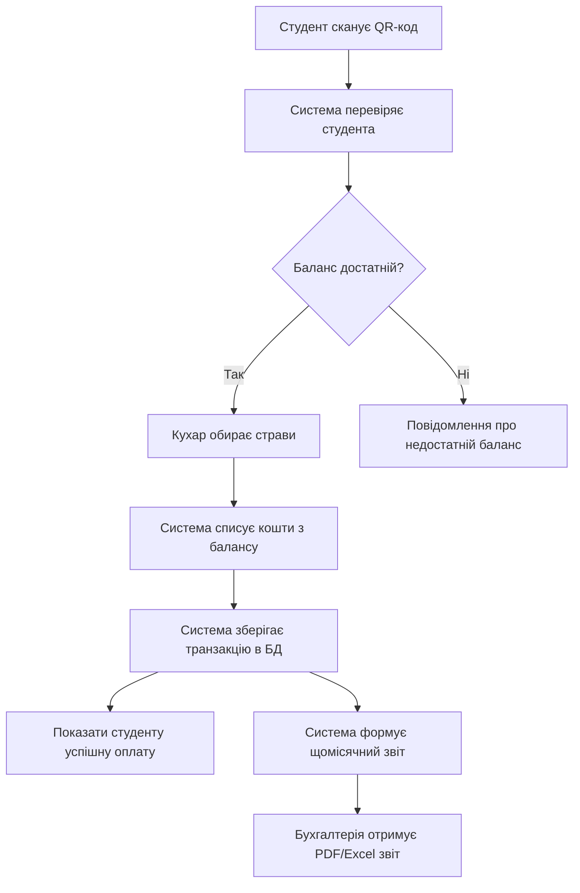

# QR Food System

**Pet-project**: автоматизація обліку харчування студентів через QR-коди.

## Проблема
- Записи ведуться вручну
- Учні стоять у чергах
- Бухгалтерія отримує неточні звіти

## Ціль
Автоматизація процесу через QR-коди та цифрові транзакції.

## Технології
- Python (Flask/FastAPI)
- PostgreSQL
- HTML/CSS/JS
- QR Library

## Актори
| Актор | Роль |
|-------|------|
| Студент | Сканує QR, оплачує страви, переглядає баланс |
| Кухар | Отримує QR-код, додає страви, проводить транзакції |
| Бухгалтерія | Переглядає та завантажує звіти |
| Адміністратор | Керує продуктами, цінами, правами доступу |

## UML / Flow Diagram

